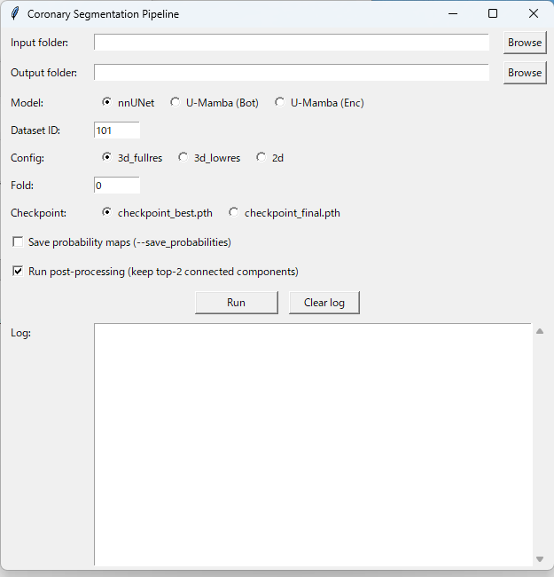

# Coronary Artery Segmentation Pipeline

A lightweight GUI tool that integrates **nnUNet** and **U-Mamba** inference with
automatic post-processing for coronary artery segmentation in CT images.

---

## Features

| Feature | Details |
|---|---|
| **Model selection** | nnUNet (standard), U-Mamba Bot, U-Mamba Enc |
| **One-click inference** | Wraps `nnUNetv2_predict` with GUI-configurable parameters |
| **Post-processing** | Retains the two largest connected components (LCA / RCA) and resolves intra-component label mixing |
| **Live log** | Streams inference output in real time |
| **Cross-platform** | Windows / Linux  |

---

## Directory Structure

```
coronary_pipeline/
├── coronary_pipeline_gui.py  # Main GUI application
├── postprocess.py            # Post-processing module (importable)
├── requirements.txt
└── README.md
```

---

## Requirements

### Python packages
```
pip install -r requirements.txt
```

### External tools (must be installed and on PATH)

| Tool | URL |
|---|---|
| nnUNet v2 | https://github.com/MIC-DKFZ/nnUNet |
| U-Mamba *(optional)* | https://github.com/bowang-lab/U-Mamba |

---

## Quick Start

### 1. Activate your nnUNet / U-Mamba conda environment

```bash
conda activate nnunet        # or your environment name
```

### 2. Set nnUNet environment variables

```bash
# Linux / macOS
export nnUNet_raw="/path/to/nnUNet_raw"
export nnUNet_preprocessed="/path/to/nnUNet_preprocessed"
export nnUNet_results="/path/to/nnUNet_results"

# Windows (PowerShell)
$env:nnUNet_raw          = "C:\path\to\nnUNet_raw"
$env:nnUNet_preprocessed = "C:\path\to\nnUNet_preprocessed"
$env:nnUNet_results      = "C:\path\to\nnUNet_results"
```

### 3. Launch the GUI
## GUI Screenshot


```bash
python coronary_pipeline_gui.py
```

---

## GUI Usage

1. **Input folder** — directory containing CT NIfTI files (`case_*.nii.gz`)  
2. **Output folder** — pipeline writes two subdirectories here:
   - `raw_predictions/`  — direct `nnUNetv2_predict` output
   - `postprocessed/`    — top-2 connected-component filtered masks
3. **Model** — select nnUNet or U-Mamba variant
4. **Dataset ID / Configuration / Fold / Checkpoint** — match your trained model
5. **Save probability maps** — passes `--save_probabilities` to nnUNetv2_predict
6. **Run post-processing** — enable/disable the connected-component step
7. Click **▶ Run Pipeline**

---

## Post-processing Logic (`postprocess.py`)

For each predicted mask:

1. **Binary labeling** — all non-zero voxels are treated as foreground.
2. **Connected-component analysis** — `scipy.ndimage.label` identifies all components.
3. **Top-N selection** — the two largest components are retained (LCA and RCA).
4. **Label-mixing correction** — within each retained component, the majority
   semantic label (1 = LCA, 2 = RCA) is assigned to all voxels, correcting
   any erroneous minority-label voxels produced by the network.

The module can also be used independently:

```python
from postprocess import run_postprocess

run_postprocess(
    input_dir="path/to/raw_predictions",
    output_dir="path/to/postprocessed",
    top_n=2,
    log_callback=print,
)
```

---

## Citation

If you use this tool in your research, please cite:

> Hattori et al. (2026). *SlicerPcatMeasure: A 3D Slicer Extension for Pericoronary Adipose Tissue Quantification*. SoftwareX. (under review)

---

## License

MIT License — see `LICENSE` for details.
